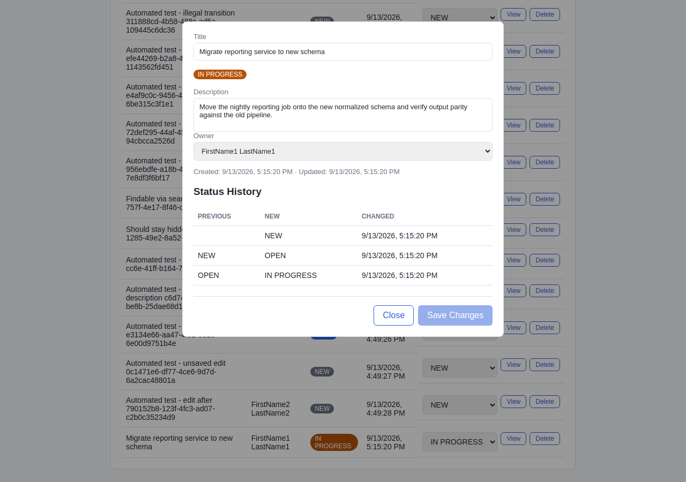

# Workflow Tracker

[](https://github.com/frankfulcomer/workflow-tracker/actions/workflows/ci.yml)

A small, self-contained web app for tracking work items through a status
pipeline (`NEW → OPEN → IN_PROGRESS → RESOLVED → CLOSED`), with owner
assignment and full status history.

## This app is a QA sandbox, not the portfolio piece

This app exists to be a realistic, controllable target for testing — a
real business-rule-driven status lifecycle, a real database, a real API.
**The actual portfolio work is the companion black-box test suite:**

**→ [workflow-tracker-tests](https://github.com/frankfulcomer/workflow-tracker-tests)** —
three independent testing layers (UI, REST API, SQL), traceability back to
documented requirements, and a real root-caused CI investigation. Start
there.

## Screenshot



## Requirements

Behavior is defined by lightweight Agile-style user stories with numbered
acceptance criteria in [`docs/product-stories.md`](docs/product-stories.md),
plus shared UI conventions in [`docs/ux-conventions.md`](docs/ux-conventions.md).
These were revised more than once as exploratory testing in the companion
repo surfaced gaps — see that repo's Notable Findings for specifics.

## Development and QA Approach

Built with AI assistance (Claude Code) accelerating implementation and
test scaffolding. Requirements and acceptance criteria, exploratory
testing, architecture decisions, code review, and final validation were
owned and directed by the developer throughout — see the companion repo's
README for the fuller account, including issues found along the way.

## CI

Every push builds this app. On success it fires a `repository_dispatch`
event carrying the exact commit SHA to the companion repo, whose own CI
checks out that revision, boots it, and runs its full regression suite
against it — see that repo's README for the sequence diagram.

## Scope & backlog

See [`docs/product-stories.md`](docs/product-stories.md) for what's
explicitly in/out of scope for the current increment and the Future
Backlog of deliberately deferred items.

## Stack

| Layer          | Choice                                   |
|----------------|-------------------------------------------|
| Backend        | Java 17, Spring Boot 3, Spring Data JPA   |
| Database       | H2 (in-memory, zero setup) by default; Oracle XE via a Spring profile |
| Frontend       | Plain HTML / CSS / vanilla JS (no framework, no build step) |
| Testing        | See [workflow-tracker-tests](https://github.com/frankfulcomer/workflow-tracker-tests) — UI (Playwright), API (REST Assured), SQL (JDBC) |

## Running it locally

Requires Java 17+ and Maven.

```bash
mvn spring-boot:run
```

Then open **http://localhost:8080**. The app seeds a handful of demo
work items and owners on first startup.

The H2 console is at **http://localhost:8080/h2-console** — JDBC URL
`jdbc:h2:mem:trackerdb`, user `sa`, no password.

### Running against real Oracle instead

```bash
export ORACLE_URL=jdbc:oracle:thin:@localhost:1521/XEPDB1
export ORACLE_USER=tracker
export ORACLE_PASSWORD=yourpassword

mvn spring-boot:run -Dspring-boot.run.profiles=oracle
```

No code changes needed — Spring picks up `application-oracle.properties`.

### The `sql-verify` profile

```bash
mvn spring-boot:run -Dspring-boot.run.profiles=sql-verify
```

Opt-in only: exposes the same in-memory H2 database over H2's TCP
protocol (`localhost:9092`) so the companion repo's SQL test layer can
connect and verify persisted state directly. Default behavior is
unaffected.
